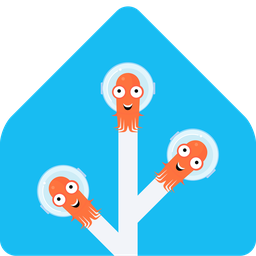

# ArgoCD for Home Assistant

<p align="center">
  
</p>

[![hacs][hacs-badge]][hacs] [](https://github.com/ygelfand/hacs-argocd/actions/workflows/validate.yml)

A custom [Home Assistant](https://www.home-assistant.io/) integration that
monitors [Argo CD](https://argo-cd.readthedocs.io/) Applications and lets you
trigger syncs and refreshes from automations and dashboards.

## Features

- **Two backends, selectable at setup:**
  - **ArgoCD REST API** — talk to the ArgoCD API server with an API token or
    username/password.
  - **Kubernetes API** — read `argoproj.io` `Application` CRDs directly from the
    kube-apiserver, using an in-cluster ServiceAccount (auto-discovered) or a
    manually supplied URL + token. No exposed ArgoCD API server required.
- **Per-application entities:**
  - `sensor` — **sync status** (Synced / OutOfSync), **health**
    (Healthy / Degraded / Progressing / …), and **last sync** (timestamp of the
    most recent sync, with `initiated_by` / `automated` attributes). Revision,
    repo, and destination are exposed as attributes.
  - `binary_sensor` — **out of sync** and **unhealthy** problem flags.
  - `button` — **Sync** and **Refresh** (when write actions are enabled).
- **Aggregate sensor** — total applications plus out-of-sync / unhealthy counts
  for quick dashboards and alerting.
- **Cluster monitoring** (REST backend) — per destination-cluster connection
  sensor (Connected / Failed) + an "unreachable" problem binary sensor, with
  server version and application count as attributes.
- **Services** — `argocd.sync` and `argocd.refresh` for automations.
- **Auto-discovery** — new applications and clusters become entities
  automatically as they appear (toggleable, on by default).
- **Filters** — optionally limit tracked applications by project and/or
  namespace, chosen from lists pulled live from your ArgoCD during setup.
- **Real-time watch (opt-in)** — stream Application changes instead of polling,
  for instant updates. Works on both backends (ArgoCD's stream endpoint / the
  Kubernetes watch API); the update interval stays on as a safety net.

## Installation

### HACS (custom repository)

[](https://my.home-assistant.io/redirect/hacs_repository/?owner=ygelfand&repository=hacs-argocd&category=Integration)

Click the badge to add this repo to HACS in one step, or add it manually:

1. HACS → ⋮ → **Custom repositories**.
2. Add `https://github.com/ygelfand/hacs-argocd` with category **Integration**.
3. Install **ArgoCD**, then restart Home Assistant.

### Manual

Copy `custom_components/argocd` into your Home Assistant `config/custom_components/`
directory and restart.

## Setup

**Settings → Devices & Services → Add Integration → ArgoCD**, then pick a backend.

### REST API backend

- **Server URL**: e.g. `https://argocd.example.com`
- **API token** (recommended): create one with
  `argocd account generate-token --account <account>` (the account needs
  `applications, get`/`sync` RBAC), **or**
- **Username & password**: exchanged for a session token; re-login happens
  automatically when it expires.

### Kubernetes backend

Apply the RBAC in [`manifests/`](manifests/) and follow
[`manifests/README.md`](manifests/README.md) to get a token. Choose:

- **In-cluster ServiceAccount** — when Home Assistant runs in the cluster; the
  token and CA are read from the mounted ServiceAccount automatically.
- **Manual** — supply the API server URL, a ServiceAccount token, and
  optionally a CA certificate.

## Options

Configure via the integration's **Configure** button:

| Option | Default | Description |
| --- | --- | --- |
| Update interval | 60 s | How often to poll ArgoCD. |
| Enable sync/refresh actions | on | Create Sync/Refresh buttons and allow writes. |
| Auto-add discovered apps | on | Create entities for apps (and clusters) that appear after setup. |
| Stream changes in real time (watch) | off | Push updates via a watch stream instead of waiting for the poll. |

## Services

```yaml
# Sync an application (optionally prune / pin a revision)
service: argocd.sync
data:
  application: guestbook
  prune: false
  # revision: HEAD
  # namespace: argocd    # only needed to disambiguate same-named apps

# Force ArgoCD to re-compare live vs. desired state
service: argocd.refresh
data:
  application: guestbook
  hard: false
```

## Credits & trademarks

The icon combines the Home Assistant logomark with the Argo CD "Argo" mascot
(CNCF/Argo project artwork). Argo and Home Assistant marks belong to their
respective projects; this is an unofficial community integration.

[hacs]: https://github.com/hacs/integration
[hacs-badge]: https://img.shields.io/badge/HACS-Custom-41BDF5.svg
